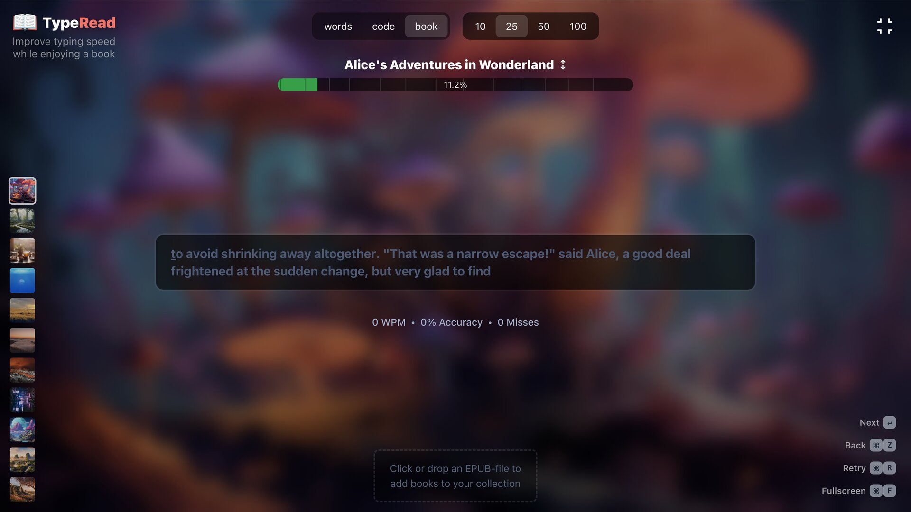

# TypeRead



Install [bun](https://bun.sh/)

Install [Go](https://go.dev/doc/install)

```
go install github.com/air-verse/air@latest
```

```
bun i
```

Restart terminal

```
bun dev
```

## Sync Frontend & Backend

```
bun sync
```
